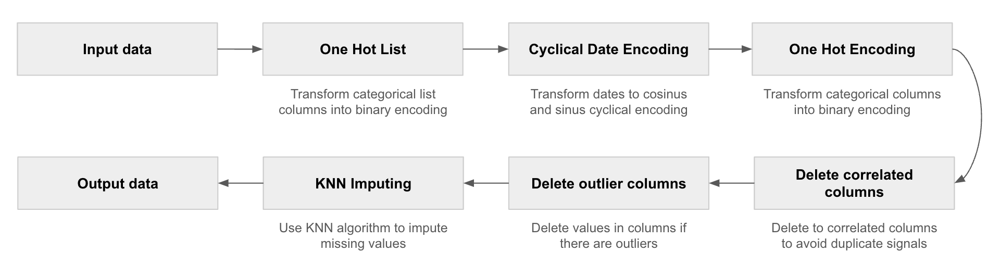
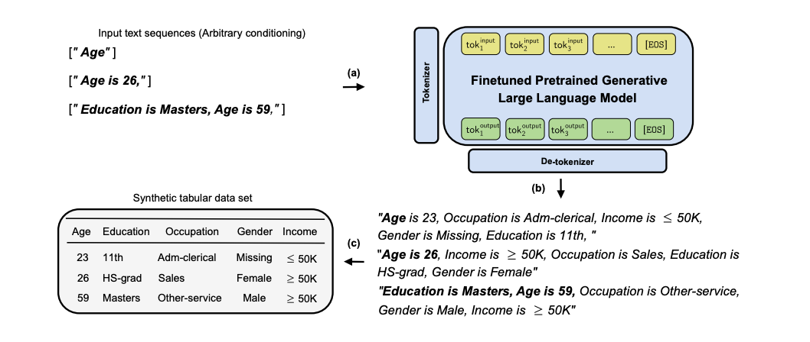
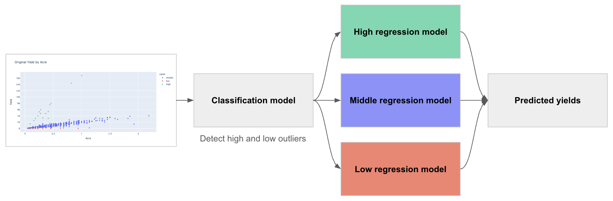

# 🌾 Crop Yield Estimate


This challenge focuses on leveraging machine learning to predict rice and wheat crop yields per acre in India, with the aim of empowering smallholder farmers and addressing issues of poverty and malnutrition. The data collected by Digital Green through surveys provides insights into farming practices, environmental conditions, and crop yields. The ultimate goal is to revolutionize Indian agriculture, offer a global model for smallholder farmers, and contribute to sustainable farming practices amid climate change, thereby advancing global food security.

This project was made possible by our compute partners [2CRSi](https://2crsi.com/) and [NVIDIA](https://www.nvidia.com/).

## 🏆 Challenge ranking
The score of the challenge was the RMSE.  
Our solution was the best one (out of 678 teams) with a RMSE equal to 100.3610312 🎉.

The podium:  
🥇 RosIA - 100.3610312  
🥈 ihar - 100.6819477  
🥉 belkasanek - 102.4325999  

## 🛠️ Data processing

### Pre-processing 



### GReaT

We used GReaT LLM (GPT-2) implementation to generate new observations and impute missing values.  
Here is how this proposed method works to create and impute data: 



## 🏛️ Model architecture



## #️⃣ Command lines

### Launch a training  

```bash
python src/models/train_model.py --estimator_name <estimator_name> --task <task> --nb_agents <nb_agents>
```
View project's runs on [WandB](https://wandb.ai/association-rosia/crop-yield-estimate/).

### Create a submission

```bash
python src/models/predict_model.py --ensemble_strategy <ensemble_strategy> --class_id <class_id_1> <class_id_2> <class_id_3> --low_id <low_id_1> <low_id_2> <low_id_3> --medium_id <medium_id_1> <medium_id_2> <medium_id_3> --high_id <high_id_1> <high_id_2> <high_id_3>
```

## 🔬 References

Hwang, Y., & Song, J. (2023). Recent deep learning methods for tabular data. Communications for Statistical Applications and Methods, 30(2), 215-226.

Shwartz-Ziv, R., & Armon, A. (2022). Tabular data: Deep learning is not all you need. Information Fusion, 81, 84-90.

Kavita, M., & Mathur, P. (2020, October). Crop yield estimation in India using machine learning. In 2020 IEEE 5th International Conference on Computing Communication and Automation (ICCCA) (pp. 220-224). IEEE.

Borisov, V., Seßler, K., Leemann, T., Pawelczyk, M., & Kasneci, G. (2022). Language models are realistic tabular data generators. arXiv preprint arXiv:2210.06280.

## 📝 Citing

```
@misc{UrgellReberga:2023,
  Author = {Baptiste Urgell and Louis Reberga},
  Title = {Crop Yield Estimate},
  Year = {2023},
  Publisher = {GitHub},
  Journal = {GitHub repository},
  Howpublished = {\url{https://github.com/association-rosia/crop-yield-estimate}}
}
```

## 🛡️ License

Project is distributed under [MIT License](https://github.com/association-rosia/crop-forecasting/blob/main/LICENSE)

## 👨🏻‍💻 Contributors <a name="contributors"></a>

Louis
REBERGA <a href="https://twitter.com/rbrgAlou"></a> <a href="https://www.linkedin.com/in/louisreberga/"></a> <a href="louis.reberga@gmail.com"></a>

Baptiste
URGELL <a href="https://twitter.com/Baptiste2108"></a> <a href="https://www.linkedin.com/in/baptiste-urgell/"></a> <a href="baptiste.u@gmail.com"></a> 
