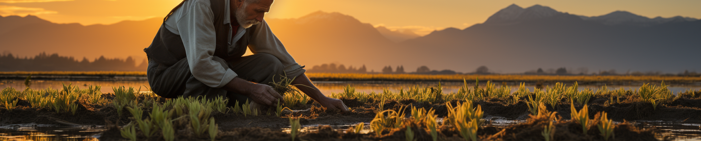

# 🌾 Digital Green Crop Yield Estimate Challenge



This challenge focuses on leveraging machine learning to predict rice and wheat crop yields per acre in India, with the aim of empowering smallholder farmers and addressing issues of poverty and malnutrition. The data collected by Digital Green through surveys provides insights into farming practices, environmental conditions, and crop yields. The ultimate goal is to revolutionize Indian agriculture, offer a global model for smallholder farmers, and contribute to sustainable farming practices amid climate change, thereby advancing global food security.

This project was made possible by our compute partners [2CRSI](https://2crsi.com/) and [NVIDIA](https://www.nvidia.com/).

## 🏆 Challenge ranking
The score of the challenge was the RMSE.  
Our solution was the best one (out of) with a RMSE equal to 100.3610312 🎉.

The podium:  
🥇 RosIA - 100.3610312  
🥈 ihar - 100.6819477  
🥉 belkasanek - 102.4325999  

## 🛠️ Data processing

### Pre-processing 

### GReaT

## 🏛️ Model architecture

## #️⃣ Command lines

### Launch a training  

```bash
python src/models/train_model.py --estimator_name <estimator_name> --task <task> --nb_agents <nb_agents>
```

### Create a submission

```bash
python src/models/predict_model.py --ensemble_strategy <ensemble_strategy> --class_id <class_id_1> <class_id_2> <class_id_3> --low_id <low_id_1> <low_id_2> <low_id_3> --medium_id <medium_id_1> <medium_id_2> <medium_id_3> --high_id <high_id_1> <high_id_2> <high_id_3>
```

## 🔬 References

## 📝 Citing

## 🛡️ License

Project is distributed under [MIT License](https://github.com/association-rosia/flair-2/blob/main/LICENSE)

## 👨🏻‍💻 Contributors <a name="contributors"></a>

Louis
REBERGA <a href="https://twitter.com/rbrgAlou"></a> <a href="https://www.linkedin.com/in/louisreberga/"></a> <a href="louis.reberga@gmail.com"></a>

Baptiste
URGELL <a href="https://twitter.com/Baptiste2108"></a> <a href="https://www.linkedin.com/in/baptiste-urgell/"></a> <a href="baptiste.u@gmail.com"></a> 


